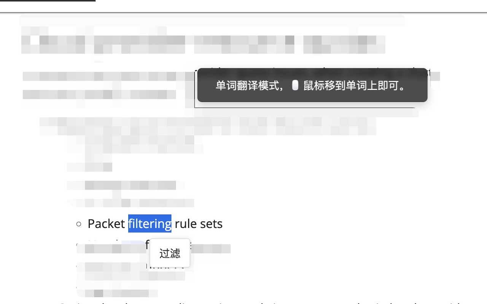
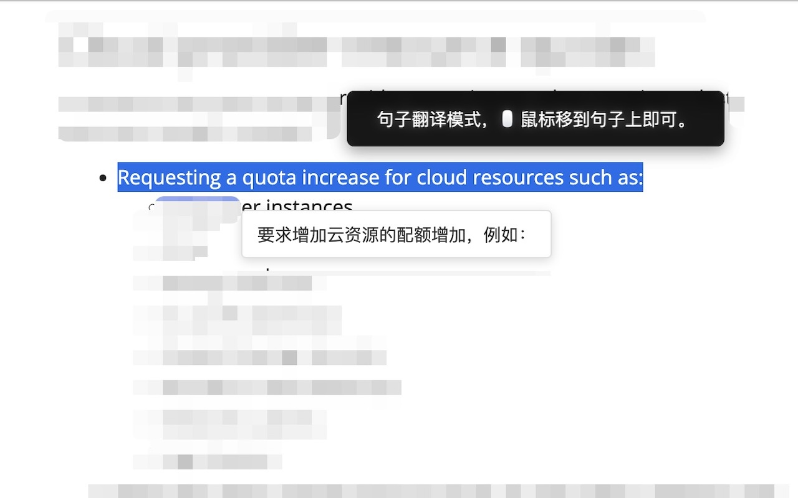
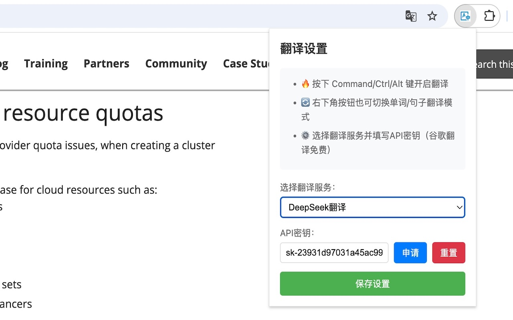

# Relax Translator 轻松翻译插件

一款由 AI 编写，简单易用的浏览器翻译插件，自动识别鼠标附近的文字，达到跟随鼠标实时翻译的效果，让阅读外文轻松自在。按（Ctrl/Command/Alt）键启动。

## ✨ 特色功能

- 🕗 **实时翻译**：按（Ctrl/Command/Alt）键启动，将鼠标指向需要翻译的文本，即可自动翻译。
- 🔄 **翻译模式切换**：再次按（Ctrl/Command/Alt）可以在单词翻译和句子翻译之间切换。
- 🚀 **选择翻译**：除了自动翻译外，还支持自定义翻译，人工选择需要翻译的文本后，按（Ctrl/Command/Alt）即可翻译。
- 🌐 **丰富的翻译服务**：
  - 谷歌翻译（免费，无需API密钥）
  - 微软翻译
  - DeepSeek翻译
  - 智谱AI翻译
  - Kimi翻译
  - ChatGPT翻译
- 🎯 **右键菜单支持**：快速切换翻译模式
- ⚙️ **灵活配置**：可自由切换不同的翻译服务

## 📸 项目截图

### 单词翻译模式

### 句子翻译模式

### 配置页面

## 🚀 从浏览器应用商店安装

谷歌浏览器应用商店直接安装：上架中

EDGE浏览器应用商店直接安装：上架中

## 🚀 从源码安装方法

1. 下载本项目的源代码解压
2. 打开 Chrome/Edge 浏览器，进入扩展程序页面（chrome://extensions/）
3. 开启右上角的「开发者模式」
4. 点击「加载已解压的扩展程序」
5. 选择本项目的文件夹

## 🔧 配置说明

### 基本设置

1. 点击浏览器工具栏中的插件图标
2. 在弹出的设置面板中选择想要使用的翻译服务
3. 如果选择的是需要API密钥的服务，请填入对应的API密钥

### API密钥申请指南

除谷歌翻译外，其他翻译服务都需要配置API密钥：

- **DeepSeek**：访问 [DeepSeek Platform](https://platform.deepseek.com/account) 获取API密钥
- **Kimi**：访问 [Moonshot Console](https://platform.moonshot.cn/console/api-keys) 创建API密钥
- **ChatGPT**：访问 [OpenAI Platform](https://platform.openai.com/api-keys) 获取API密钥
- **智谱AI**：访问 [智谱AI开放平台](https://open.bigmodel.cn/usercenter/apikeys) 创建API密钥
- **微软翻译**：访问 [Azure Portal](https://portal.azure.com/#create/Microsoft.CognitiveServicesTextTranslation) 创建翻译服务

## 📖 使用说明

### 快捷键操作

1. 按 Ctrl（Windows）/ Command（Mac）/ Alt 键启动翻译模式。
2. 将鼠标移动到需要翻译的文本上，翻译结果会实时显示在鼠标附近。
3. 再次按 Ctrl（Windows）/ Command（Mac）/ Alt 可以在单词翻译和句子翻译之间切换。

### 右键菜单

- 右键点击页面任意位置
- 选择「开始单词翻译」或「开始句子翻译」
- 之后可以移动鼠标进行翻译

## 🤝 贡献指南

欢迎提交 Issue 和 Pull Request 来帮助改进这个项目！

## 📄 开源协议

本项目采用 MIT 协议开源，详见 [LICENSE](LICENSE) 文件。

## 🙏 致谢

感谢所有为本项目提供支持和帮助的贡献者！

**内测反馈**

@蔡🤔
@Zhao先森
@贰零贰号
@Pan🐷
@Expectation
@錦

**开发工具**

本翻译插件，所有功能完全由 AI 生成，人工仅参与修改 5% 的样式和 8% 的逻辑优化。
AI 编程工具来自：https://www.trae.ai/
开发者如果有改进想法，可以直接用 Trae 编辑器，让 AI 进行修改。
