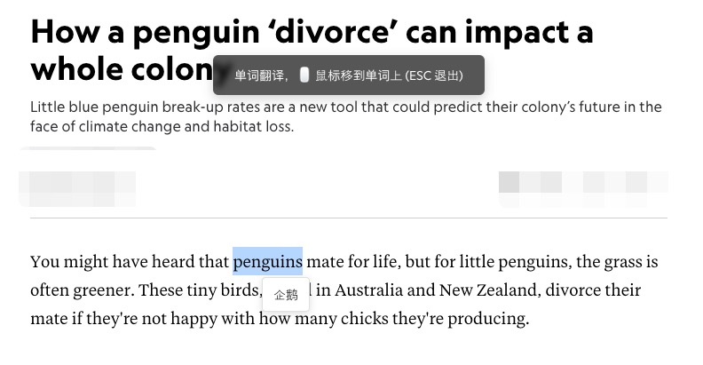
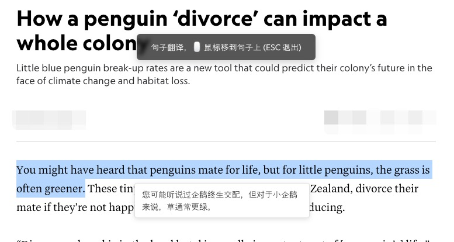
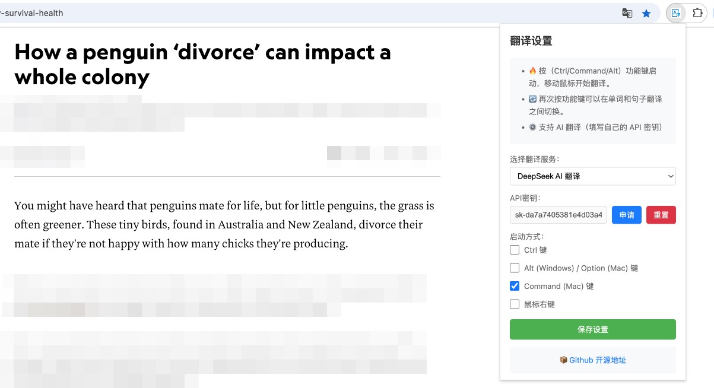

# Relax Translator 轻松翻译插件

一款完全由人工智能（AI）编写的浏览器翻译插件，能自动识别鼠标附近的文字，跟随鼠标实时翻译。按（Ctrl/Command/Alt）功能键启动，支持自定义启动键。

> 简约好用，阅读外文更专注。

## 📖 使用说明

### 快捷键操作

1. 按 Ctrl（Windows）/ Command（Mac）/ Alt 功能键启动翻译模式。
2. 将鼠标移动到需要翻译的文本上，翻译结果会实时显示在鼠标附近。
3. 再次按功能键可以在单词翻译和句子翻译之间切换。
4. 人工选择需要翻译的内容，按功能键可以实现自定义翻译。

### 右键菜单

- 右键点击页面任意位置
- 选择「开始单词翻译」或「开始句子翻译」
- 之后可以移动鼠标进行翻译

## 🔧 配置说明

### 基本设置

1. 点击浏览器工具栏中的插件图标
2. 在弹出的设置面板中选择想要使用的翻译服务
3. 如果选择的是需要API密钥的服务，请填入对应的API密钥

## ✨ 特色功能

- 🕗 **实时翻译**
- 🚀 **选择翻译**
- ⚙️ **灵活配置**：可自由切换不同的翻译服务
- 🌐 **丰富的翻译服务**：
  - 谷歌翻译（免费，无需API密钥）
  - 微软翻译（免费，无需API密钥）
  - DeepSeek翻译
  - 智谱AI翻译
  - Kimi翻译
  - ChatGPT翻译

## 📸 项目截图

### 单词翻译模式

### 句子翻译模式

### 配置页面

## 🚀 从浏览器应用商店安装

Google 浏览器应用商店安装：[Relax Translator(轻松翻译)](https://chromewebstore.google.com/detail/relax-translator/acmocohkjfakneioiidbpgfjmehpmfcm)

Edge 浏览器应用商店安装：[Relax Translator(轻松翻译)](https://microsoftedge.microsoft.com/addons/detail/olmjgggbmcbieaimmcloklanadppmedn)

## 🚀 从源码安装方法

1. 下载本项目的源代码解压
2. 打开 Chrome/Edge 浏览器，进入扩展程序页面（chrome://extensions/）
3. 开启右上角的「开发者模式」
4. 点击「加载已解压的扩展程序」
5. 选择本项目的文件夹

### API密钥申请指南

除谷歌翻译外，其他翻译服务都需要配置API密钥：

- **DeepSeek**：访问 [DeepSeek Platform](https://platform.deepseek.com/account) 获取API密钥
- **Kimi**：访问 [Moonshot Console](https://platform.moonshot.cn/console/api-keys) 创建API密钥
- **ChatGPT**：访问 [OpenAI Platform](https://platform.openai.com/api-keys) 获取API密钥
- **智谱AI**：访问 [智谱AI开放平台](https://open.bigmodel.cn/usercenter/apikeys) 创建API密钥
- **微软翻译**：访问 [Azure Portal](https://portal.azure.com/#create/Microsoft.CognitiveServicesTextTranslation) 创建翻译服务

## 🤝 贡献指南

欢迎提交 Issue 和 Pull Request 来帮助改进这个项目！

## 📄 开源协议

本项目采用 MIT 协议开源，详见 [LICENSE](LICENSE) 文件。

## 🙏 致谢

感谢所有为本项目提供支持和帮助的贡献者！

**内测反馈**

@蔡🤔
@Zhao先森
@贰零贰号
@Pan🐷
@Expectation
@錦

**AI开发声明**

本软件，所有功能完全由 AI 生成，人工仅参与修改 1% 的样式和 5% 的逻辑优化。

开发者如果有改进想法，可以直接用 AI 编程工具进行修改。

 - Cursor
 - Trae
 - Tongyiqianwen(插件)
 - Gemini Code Assist(插件)
